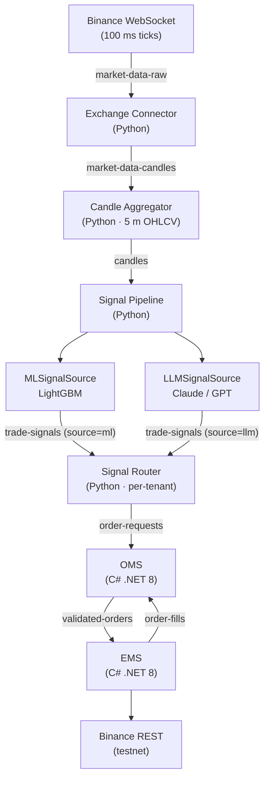

# Trading Platform

Multi-tenant crypto algorithmic trading platform. Binance WebSocket ticks flow through a Kafka event pipeline (Python) into OMS/EMS microservices (C# .NET 8) backed by PostgreSQL + TimescaleDB, with full observability via Prometheus, Grafana, and Jaeger.

## Architecture



Signal sources are pluggable — select via `SIGNAL_SOURCE=ml|llm|both`. LLM signals are generated by Claude or GPT analysing recent candle data and technical indicators, running at a configurable slower cadence (default 15 min) to manage API cost.

## Repository Structure

```
traading_system/
├── pipeline/                   # Python services
│   ├── exchange_connector/     # Binance WS → Kafka
│   ├── candle_aggregator/      # Raw ticks → 5m OHLCV candles
│   ├── signal_pipeline/        # ML signal generation
│   ├── signal_router/          # Per-tenant order routing
│   └── shared/                 # Kafka, DB, logging, models
├── engine/                     # C# .NET 8 microservices
│   └── src/
│       ├── OMS/                # Order Management Service
│       ├── EMS/                # Execution Management Service
│       └── TradingPlatform.Shared/
├── db/migrations/              # PostgreSQL + TimescaleDB schemas
├── infra/                      # Docker Compose + Kafka topics
├── observability/              # Prometheus, Grafana, Jaeger configs
└── scripts/                    # Dev helpers
```

## Service Ports

| Service     | Port  | Notes                      |
|-------------|-------|----------------------------|
| OMS API     | 5001  | Order placement/query      |
| EMS API     | 5002  | Execution status           |
| Kafka       | 9092  | External access            |
| PostgreSQL  | 5432  |                            |
| Redis       | 6379  |                            |
| Prometheus  | 9090  |                            |
| Grafana     | 3000  | admin / admin              |
| Jaeger UI   | 16686 | Distributed tracing        |

## Quick Start

```bash
# 1. Configure environment
cp .env.example .env
# Edit .env — set POSTGRES_PASSWORD, BINANCE_API_KEY, BINANCE_SECRET_KEY

# 2. Start the full stack
cd infra
docker-compose up -d

# 3. Seed tenant data
docker exec -i infra-postgres-1 psql -U trading -d trading \
  < ../scripts/seed-tenants.sql

# 4. Verify Kafka flow
bash ../scripts/verify-kafka-flow.sh
```

Or use the dev script:
```bash
bash scripts/start-dev.sh
```

## Running Tests

```bash
# Python — from repo root
cd pipeline
ruff check . && ruff format --check .
mypy shared/ exchange_connector/src/ candle_aggregator/src/ signal_router/src/ signal_pipeline/src/
PYTHONPATH=$(pwd) pytest

# C# — from repo root
cd engine
dotnet build --warnaserror
dotnet test
```

## Kafka Topics

| Topic                | Producer           | Consumer          |
|----------------------|--------------------|-------------------|
| `market-data-raw`    | exchange_connector | candle_aggregator |
| `market-data-candles`| candle_aggregator  | signal_pipeline   |
| `trade-signals`      | signal_pipeline    | signal_router     |
| `order-requests`     | signal_router      | OMS               |
| `validated-orders`   | OMS                | EMS               |
| `order-fills`        | EMS                | OMS               |

## Environment Variables

| Variable                  | Required | Default                              | Description                         |
|---------------------------|----------|--------------------------------------|-------------------------------------|
| `POSTGRES_PASSWORD`       | Yes      | —                                    | PostgreSQL password                 |
| `BINANCE_API_KEY`         | Yes      | —                                    | Binance (testnet) API key           |
| `BINANCE_SECRET_KEY`      | Yes      | —                                    | Binance (testnet) secret key        |
| `BINANCE_BASE_URL`        | No       | `https://testnet.binance.vision`     | Use testnet for local dev           |
| `KAFKA_BROKERS`           | No       | `kafka:9092`                         |                                     |
| `TRADE_SYMBOLS`           | No       | `btcusdt,ethusdt`                    | Comma-separated symbols             |
| `CANDLE_TIMEFRAME_MINUTES`| No       | `5`                                  |                                     |
| `SIGNAL_MIN_CONFIDENCE`        | No       | `0.7`                            | Min ML confidence to emit a signal       |
| `SIGNAL_TTL_SECONDS`           | No       | `90`                             | Signal staleness cutoff                  |
| `SIGNAL_INTERVAL_SECONDS`      | No       | `300`                            | ML signal generation cadence             |
| `SIGNAL_SOURCE`                | No       | `ml`                             | `ml`, `llm`, or `both`                   |
| `LLM_PROVIDER`                 | No       | `anthropic`                      | `anthropic` or `openai`                  |
| `ANTHROPIC_API_KEY`            | Only if `LLM_PROVIDER=anthropic` | — | Anthropic API key               |
| `OPENAI_API_KEY`               | Only if `LLM_PROVIDER=openai`    | — | OpenAI API key                  |
| `LLM_SIGNAL_INTERVAL_SECONDS`  | No       | `900`                            | LLM signal cadence (s) — manage API cost |
| `LLM_CANDLE_WINDOW`            | No       | `20`                             | Candles sent in LLM prompt               |
| `LOG_LEVEL`                    | No       | `INFO`                           |                                          |

## Completeness Status

| Component                        | Status      |
|----------------------------------|-------------|
| Exchange Connector               | Complete    |
| Candle Aggregator                | Complete    |
| Signal Pipeline (ML + LLM sources) | Complete    |
| Signal Router                    | Complete    |
| OMS Microservice                 | Complete    |
| EMS Microservice                 | Complete    |
| Database Migrations (007)        | Complete    |
| Docker Compose + healthchecks    | Complete    |
| Kafka topic provisioning         | Complete    |
| Observability (Prometheus/Grafana/Jaeger) | Complete |
| CI — GitHub Actions (Python + .NET) | Complete |
| OMS Domain ValueObjects          | Empty — placeholder dirs only |
| React Dashboard                  | Not started |
